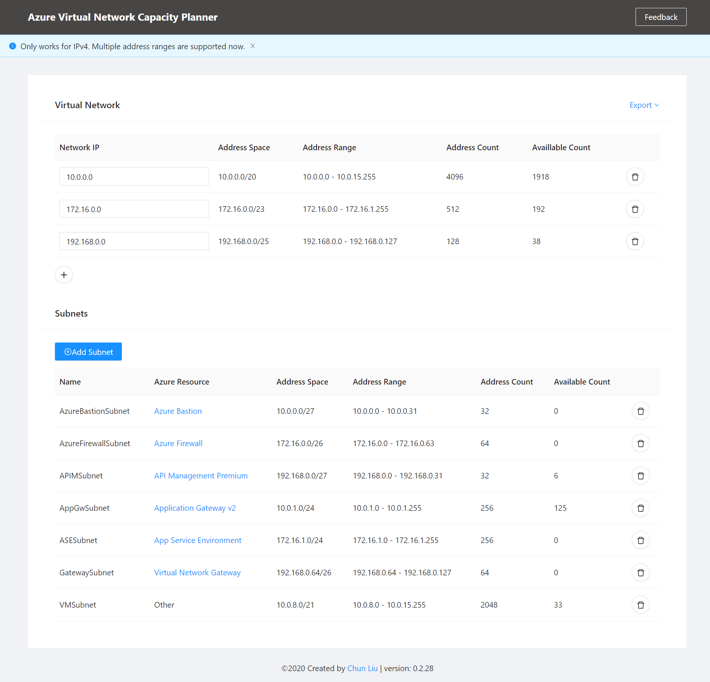

# Azure Virtual Network Capacity Planner

This is a small app which can help you plan the capacity (address space) of an Azure virtual network based on the Azure resources that you need to integrate with the virtual network. 

## Features

- Calculate the subnet size for specific Azure resources.
- Calculate the address space based on all subnets in it.
- Support multiple address spaces.
- Export the result as the ARM template or the csv file.

## Libraries

The app is developped with [Blazor](https://dotnet.microsoft.com/apps/aspnet/web-apps/blazor) and the following libraries are being used. 

- [Ant Design Blazor](https://antblazor.com/en-US/)
- [IPNetwork](https://github.com/lduchosal/ipnetwork)

## Disclaimer

The app is a personal project without any warranty. It is neither an official product from Microsoft nor supported by Microsoft. Use it at your own risk.
